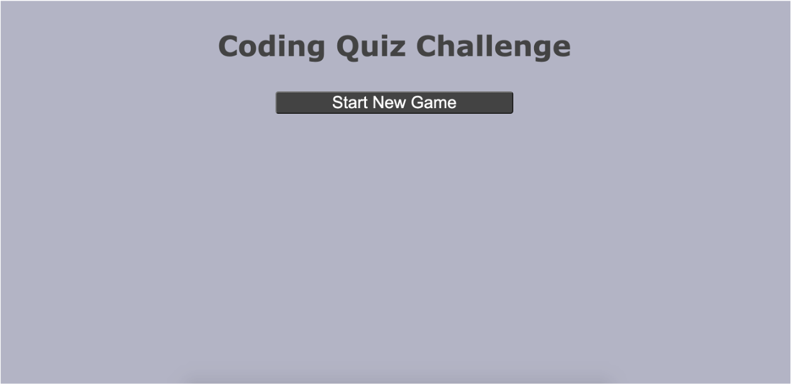

# Bootcamp4_CodeQuiz

To help familiarize you with these tests and allow you to use the skills covered in this unit, this week’s homework is to build a timed coding quiz with multiple-choice questions. This app will run in the browser and will feature dynamically updated HTML and CSS powered by JavaScript code that you write. It will have a clean, polished, and responsive user interface. 

It is available to view in github pages here: [https://epurpur.github.io/Bootcamp4_CodeQuiz/](https://epurpur.github.io/Bootcamp4_CodeQuiz/)

## Acceptance Criteria

```
GIVEN I am taking a code quiz
WHEN I click the start button
THEN a timer starts and I am presented with a question
WHEN I answer a question
THEN I am presented with another question
WHEN I answer a question incorrectly
THEN time is subtracted from the clock
WHEN all questions are answered or the timer reaches 0
THEN the game is over
WHEN the game is over
THEN I can save my initials and my score
```

## Known Issues
1. Timer doesn't work right
    - As of now, the timer counts down. When the clock hits 0, the game should be over immediately. As of now, when the clock is 0, the game will not show "game over" until the user clicks another answer choice.


## Gameplay
Here is what the game looks like as it goes through the steps:

#### Landing page
Upon loading, user sees this:


#### Questions page
When playing, user sees this:


#### Submission page
When game is over, user sees this:


#### High Scores page
When clicks 'submit', game goes to High Scores page. User can click 'Play Again' to play another game

